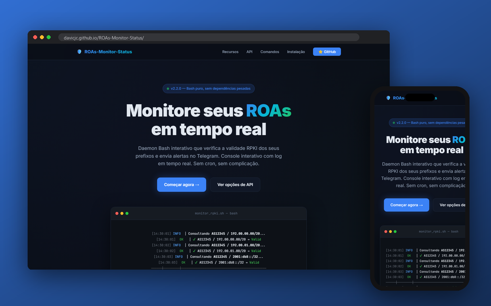

<p align="center">
  
  
  
  
</p>

<h1 align="center">
  🛡️ ROAs-Monitor-Status
</h1>

<p align="center">
  <strong>Daemon interativo de monitoramento RPKI com alertas Telegram</strong><br>
  <sub>Monitore os ROAs do seu ASN em tempo real. Sem cron. Sem systemd timer. Sem complicação.</sub>
</p>

<p align="center">
  <a href="#-o-que-é-rpki-e-por-que-monitorar">O que é RPKI?</a> •
  <a href="#-como-funciona">Como funciona</a> •
  <a href="#-instalação-rápida">Instalação</a> •
  <a href="#%EF%B8%8F-escolha-da-api--fontes-de-validação">Escolha da API</a> •
  <a href="#-comandos">Comandos</a> •
  <a href="#-configuração-completa">Configuração</a>
</p>

---


<p align="center">
  
</p>

## 🔐 O que é RPKI e por que monitorar?

**RPKI** (Resource Public Key Infrastructure) é o sistema de segurança que protege o roteamento da internet. Ele funciona como um "certificado digital" para rotas BGP — quando você publica um **ROA** (Route Origin Authorization), está declarando oficialmente: *"Eu, AS12345, sou o dono legítimo do prefixo 192.00.00.00/20 e autorizo seu anúncio."*

### Por que isso importa?

Sem RPKI, qualquer ASN pode anunciar qualquer prefixo — acidental ou maliciosamente. Isso é o chamado **BGP hijack**, e pode redirecionar todo o tráfego dos seus IPs para outro lugar do mundo.

Com ROAs publicados e validados, os grandes operadores do mundo **descartam** automaticamente anúncios ilegítimos (RPKI Invalid), protegendo seus prefixos.

### O problema

Se o seu ROA **expira**, **fica incorreto** ou o **Krill** (o servidor RPKI) para de funcionar, seus prefixos podem ser vistos como **Invalid** pela internet global — e os operadores que fazem validação RPKI **param de aceitar suas rotas**. Resultado? **Queda total de conectividade.**

**ROAs-Monitor-Status** existe para evitar isso: ele verifica continuamente se os seus ROAs estão válidos e te alerta no Telegram **antes** que vire um problema.

---

## 🚀 Como funciona

O monitor roda como um **daemon interativo** no terminal — com console, prompt de comandos e log em tempo real:

```
$ ./monitor_rpki.sh

  ╔══════════════════════════════════════════════════════════════╗
  ║     ██████   ██████   █████       █████  ███████ ██   ██     ║
  ║     ██   ██ ██    ██ ██   ██     ██   ██ ██      ████ ██     ║
  ║     ██████  ██    ██ ███████     ███████ ███████  ██ ████    ║
  ║     ██   ██ ██    ██ ██   ██     ██   ██      ██ ██  ███     ║
  ║     ██   ██  ██████  ██   ██     ██   ██ ███████ ██   ██     ║
  ║             M O N I T O R   v2.2.0                           ║
  ╚══════════════════════════════════════════════════════════════╝

[14:30:00] INFO  │ Servidor iniciado em 2026-02-23 14:30:00
[14:30:00] INFO  │ API RPKI: Routinator local — http://192.00.00.00:8323
[14:30:00] INFO  │ Bot Telegram: ATIVO — Comandos: /log /status /check /help
──────┼─────────┼────────────────────────────────────────────────
[14:30:01] INFO  │ Consultando AS12345 / 192.00.00.00/20...
[14:30:01]  OK   │ ✔ AS12345 / 192.00.00.00/20 → Valid
[14:30:02] INFO  │ Consultando AS12345 / 192.00.01.00/20...
[14:30:02]  OK   │ ✔ AS12345 / 192.00.01.00/20 → Valid
──────┼─────────┼────────────────────────────────────────────────
[14:30:02]  OK   │ Tudo OK! 2 prefixo(s) com status Valid.
[14:30:02] INFO  │ Próxima verificação: 14:40:02 (intervalo: 600s)
──────┼─────────┼────────────────────────────────────────────────
▶ monitor > _
```

### Ciclo de vida

```
┌─────────────┐     ┌──────────────┐     ┌─────────────┐
│  Inicia o   │────▶│  Consulta a  │────▶│  Tudo OK?   │
│   daemon    │     │  API (RPKI)  │     │             │
└─────────────┘     └──────────────┘     └──────┬──────┘
                                                │
                              ┌─────────────────┼─────────────────┐
                              │ SIM             │                │ NÃO
                              ▼                 │                ▼
                    ┌─────────────┐             │     ┌──────────────────┐
                    │ Log: Valid  │             │     │ 🚨 ALERTA RPKI  │
                    │ (opcional:  │             │     │ Envia Telegram   │
                    │ envia OK)   │             │     │ com detalhes     │
                    └──────┬──────┘             │     └────────┬─────────┘
                           │                    │              │
                           ▼                    │              ▼
                    ┌─────────────┐             │     ┌─────────────┐
                    │  Aguarda    │◀────────────┘     │  Aguarda    │
                    │  intervalo  │                    │  intervalo  │
                    └──────┬──────┘                    └──────┬──────┘
                           │                                  │
                           └────────────┬─────────────────────┘
                                        │
                                        ▼
                                 ┌──────────────┐
                                 │  Próximo     │
                                 │  check...    │
                                 └──────────────┘
```

---

## ⚡ Instalação rápida

### Pré-requisitos

- Linux (qualquer distribuição)
- `curl` e `jq`

```bash
# Debian / Ubuntu
sudo apt install jq curl -y

# CentOS / RHEL / Fedora
sudo yum install jq curl -y
```

### 1. Clonar o repositório

```bash
git clone https://github.com/davicjc/ROAs-Monitor-Status.git
cd ROAs-Monitor-Status
```

### 2. Criar o arquivo de configuração

```bash
cp config.env.example config.env
nano config.env   # preencha com seus dados
```

### 3. Dar permissão de execução

```bash
chmod +x monitor_rpki.sh
```

### 4. Iniciar o monitor (com `screen`)

```bash
screen -S rpki-monitor ./monitor_rpki.sh

# Para desatachar (sair sem parar): Ctrl+A, D
# Para reconectar ao console:       screen -r rpki-monitor
```

Pronto! O monitor inicia, faz a primeira verificação e fica rodando com o prompt interativo.

---

## 🏗️ Escolha da API — Fontes de Validação

O ROAs-Monitor-Status suporta **duas fontes** para consultar a validade RPKI dos seus prefixos. Essa escolha é feita no `config.env` via a variável `RPKI_API_MODE`.

### Opção 1: `ripestat` — API Pública do RIPE (padrão)

```bash
RPKI_API_MODE="ripestat"
```

Usa a API pública `stat.ripe.net` para validação. **Não precisa de infraestrutura própria.**

| Prós | Contras |
|------|---------|
| ✅ Funciona imediatamente, sem nada para instalar | ⚠️ Rate limiting (~100 req/5min) |
| ✅ Reflete a visão global da internet | ⚠️ Latência de rede (depende da internet) |
| ✅ Não requer servidor Routinator | ⚠️ Pode ter instabilidade ocasional |

O monitor tenta **HTTPS primeiro** e faz **fallback para HTTP** automaticamente se a conexão segura falhar — garantindo resiliência mesmo em ambientes com problemas de certificado ou proxy.

> 💡 **Ideal para:** quem está começando, testes, ambientes sem Routinator.

### Opção 2: `routinator` — API Local (recomendado para produção)

```bash
RPKI_API_MODE="routinator"
ROUTINATOR_URL="http://192.00.00.00:8323"
```

Usa uma instância local do [Routinator](https://www.nlnetlabs.nl/projects/rpki/routinator/) (validador RPKI da NLnet Labs).

| Prós | Contras |
|------|---------|
| ✅ **Sem rate limiting** — consulte quantas vezes quiser | ❌ Requer Routinator instalado |
| ✅ **Resposta instantânea** (<50ms) | ❌ Precisa de servidor/VPS |
| ✅ **Dados em tempo real** (atualiza a cada sync) | ❌ Manutenção do serviço |
| ✅ **Sem dependência de internet** para a consulta | |
| ✅ **Mais confiável** em produção | |

> 💡 **Ideal para:** ISPs, datacenters, ambientes de produção que já rodam Routinator.

### Por que usamos API local na nossa implementação

Na nossa empresa (**AS12345**), optamos pelo **Routinator local** pelos seguintes motivos:

1. **Velocidade** — A consulta é feita em rede local (LAN), respondendo em milissegundos ao invés de segundos
2. **Sem rate limiting** — Com 7 prefixos monitorados a cada 6 horas, não queremos depender de limites de API externa
3. **Confiabilidade** — Se a internet cair, o monitor continua funcionando (irônico, mas útil para diagnóstico)
4. **Dados frescos** — O Routinator faz sync com os Trust Anchors periodicamente, então os dados são tão atuais quanto o último sync
5. **Autonomia** — Não dependemos de terceiros para monitorar nossa própria infraestrutura

Se você não tem um Routinator, use `ripestat` — funciona perfeitamente para a maioria dos cenários.

### Verificando falsos resultados

Se você suspeitar de um **falso positivo** (a API local dizendo que algo é inválido quando não deveria), recomendamos consultar a API pública para confirmar:

```bash
# Verificar via RIPEstat (HTTPS)
curl -s "https://stat.ripe.net/data/rpki-validation/data.json?resource=12345&prefix=192.00.00.00/20" | jq '.data.status'

# Se HTTPS falhar, tente HTTP
curl -s "http://stat.ripe.net/data/rpki-validation/data.json?resource=12345&prefix=192.00.00.00/20" | jq '.data.status'

# Verificar via Routinator local
curl -s "http://seu-routinator:8323/api/v1/validity/12345/192.00.00.00/20" | jq '.validated_route.validity.state'
```

### Instalando o Routinator (se quiser usar API local)

```bash
# Debian/Ubuntu
sudo apt install routinator

# Ou via cargo (Rust)
cargo install routinator

# Inicializar (baixa Trust Anchors)
routinator init --accept-arin-rpa

# Rodar com API HTTP na porta 8323
routinator server --http 0.0.0.0:8323
```

Mais detalhes: [Documentação oficial do Routinator](https://routinator.docs.nlnetlabs.nl/)

---

## 🎮 Comandos

### Console (terminal interativo)

Enquanto o monitor está rodando, digite comandos diretamente no prompt:

| Comando | Atalho | Descrição |
|---------|--------|-----------|
| `check` | `c` | Forçar verificação agora |
| `status` | `s` | Exibir status, uptime, API e contadores |
| `pause` | `p` | Pausar verificações automáticas |
| `resume` | `r` | Retomar verificações automáticas |
| `interval <seg>` | `i` | Alterar intervalo (ex: `interval 300`) |
| `test` | `t` | Enviar mensagem de teste ao Telegram |
| `reload` | — | Recarregar arquivo de configuração |
| `prefixes` | — | Listar prefixos monitorados |
| `clear` | `cls` | Limpar tela do console |
| `help` | `h` | Mostrar menu de ajuda |
| `stop` | `q` | Parar o monitor |

```
▶ monitor > status         # ver uptime e contadores
▶ monitor > interval 300   # mudar para 5 minutos
▶ monitor > check          # forçar verificação agora
▶ monitor > pause          # pausar o timer
▶ monitor > test           # enviar teste ao Telegram
▶ monitor > stop           # encerrar o monitor
```

### Bot Telegram

O bot fica escutando mensagens automaticamente (polling a cada 1s):

| Comando | Descrição |
|---------|-----------|
| `/log` | Envia arquivo .txt com log dos últimos **7 dias** |
| `/logall` | Envia log completo (todo o histórico) |
| `/status` | Mostra status: uptime, API, contadores, próximo check |
| `/check` | Força verificação RPKI agora (responde com resultado) |
| `/pause` | Pausa verificações automáticas |
| `/resume` | Retoma verificações automáticas |
| `/help` | Lista de comandos |

#### Registrando comandos no BotFather

Para que apareçam como sugestões no Telegram:

1. Abra `@BotFather` → `/setcommands` → selecione seu bot
2. Cole:

```
log - Receber log dos ultimos 7 dias
logall - Receber log completo
status - Ver status atual do monitor
check - Forcar verificacao RPKI agora
pause - Pausar verificacoes automaticas
resume - Retomar verificacoes automaticas
help - Ver comandos disponiveis
```

---

## 📋 Configuração completa

Edite o arquivo `config.env`:

| Variável | Obrigatória | Padrão | Descrição |
|----------|:-----------:|--------|-----------|
| `TELEGRAM_BOT_TOKEN` | ✅ | — | Token do bot Telegram |
| `TELEGRAM_CHAT_ID` | ✅ | — | ID do chat/grupo para alertas |
| `PREFIXOS` | ✅ | — | Lista de `ASN,PREFIXO` separadas por `;` |
| `RPKI_API_MODE` | | `ripestat` | `ripestat` (público) ou `routinator` (local) |
| `ROUTINATOR_URL` | ¹ | — | URL do Routinator (ex: `http://192.00.00.00:8323`) |
| `CHECK_INTERVAL` | | `600` | Intervalo entre checks em **segundos** |
| `MONITORAR_KRILL_LOCAL` | | `false` | Checar `systemctl is-active krill` |
| `KRILL_API_URL` | | — | URL da API do Krill |
| `KRILL_API_TOKEN` | | — | Token de autenticação da API do Krill |
| `ENVIAR_OK` | | `false` | Enviar confirmação no Telegram quando tudo OK |
| `ENVIAR_OK_INTERVALO` | | `6` | De quantas em quantas **horas** enviar OK (0 = toda check) |
| `TELEGRAM_BOT_COMMANDS` | | `true` | Habilitar comandos via bot Telegram |

<sup>¹ Obrigatório apenas se `RPKI_API_MODE="routinator"`</sup>

### Referência rápida de intervalos

| Valor | Tempo | Recomendação |
|-------|-------|--------------|
| `300` | 5 min | Monitoramento agressivo |
| `600` | 10 min | **Padrão** — bom equilíbrio |
| `1800` | 30 min | Uso moderado |
| `3600` | 1 hora | Conservador |
| `21600` | 6 horas | Verificação periódica |

### Como obter os dados de configuração

<details>
<summary><strong>🤖 TELEGRAM_BOT_TOKEN</strong></summary>

1. No Telegram, abra `@BotFather`
2. Envie `/newbot`
3. Escolha um nome (ex: `ROA Monitor`)
4. Escolha username (deve terminar com `bot`, ex: `meu_roa_bot`)
5. O BotFather retorna o token: `123456789:ABCDefGhIjKlMnOpQrStUvWxYz`
</details>

<details>
<summary><strong>💬 TELEGRAM_CHAT_ID</strong></summary>

1. Mande qualquer mensagem ao seu bot
2. Acesse: `https://api.telegram.org/bot<TOKEN>/getUpdates`
3. Procure `"chat":{"id":123456789}` — esse é o Chat ID
4. Para **grupos**: adicione o bot, mande msg no grupo, o ID será negativo (ex: `-1001234567890`)
</details>

<details>
<summary><strong>📡 PREFIXOS</strong></summary>

Formato: `ASN,PREFIXO` separados por `;`

Para descobrir seus prefixos:
- Acesse [bgp.he.net](https://bgp.he.net/) e pesquise seu ASN
- Ou: `curl -s "https://stat.ripe.net/data/announced-prefixes/data.json?resource=AS12345" | jq '.data.prefixes[].prefix'`

```bash
# Exemplo com múltiplos prefixos
PREFIXOS="12345,192.00.00.00/20; 12345,192.00.01.00/20; 12345,2001:db8::/32"
```
</details>

---

## 🖥️ Rodando em produção

### Com `screen` (recomendado)

```bash
screen -dmS rpki-monitor ./monitor_rpki.sh

# Reconectar ao console:
screen -r rpki-monitor
# Desatachar: Ctrl+A, D
```

### Com `tmux`

```bash
tmux new -d -s rpki-monitor './monitor_rpki.sh'

# Reconectar:
tmux attach -t rpki-monitor
# Desatachar: Ctrl+B, D
```

### Como serviço systemd

Para rodar sem console interativo:

```ini
# /etc/systemd/system/rpki-monitor.service
[Unit]
Description=ROAs-Monitor-Status - RPKI Validation Daemon
After=network-online.target
Wants=network-online.target

[Service]
Type=simple
ExecStart=/opt/ROAs-Monitor-Status/monitor_rpki.sh
WorkingDirectory=/opt/ROAs-Monitor-Status
Restart=always
RestartSec=30
User=nobody
StandardInput=null

[Install]
WantedBy=multi-user.target
```

```bash
sudo systemctl daemon-reload
sudo systemctl enable --now rpki-monitor
```

> **Nota:** Quando rodando via systemd, o stdin não está disponível — o monitor opera no modo automático (sem console) mas os comandos continuam funcionando via Telegram.

---

## 📁 Estrutura do Projeto

```
ROAs-Monitor-Status/
├── monitor_rpki.sh       # Script principal (daemon interativo)
├── config.env.example    # Modelo de configuração
├── config.env            # Sua configuração (não versionado)
├── logs/                 # Diretório de logs (criado automaticamente)
│   └── monitor.log       # Log permanente (nunca apagado)
├── .monitor.pid          # PID do processo (auto)
├── .last_state           # Último estado conhecido (auto)
├── .tg_offset            # Offset do polling Telegram (auto)
├── .gitignore
├── docs/                 # Site de documentação
│   └── index.html        # Página do projeto
└── README.md
```

---

## 📨 Exemplos de alertas

### 🚨 Alerta Crítico (Telegram)

```
🚨 ALERTA RPKI CRÍTICO 🚨

1 problema(s) de 3 prefixo(s):

❌ AS12345 / 192.00.00.00/20 → INVALID

🕐 2026-02-23 14:30:00
🖥️ srv-rpki-01

Verifique seu Krill imediatamente!
```

### ✅ Tudo OK (quando `ENVIAR_OK=true`)

```
✅ RPKI OK — Todos os 3 prefixo(s) estão Valid.
🕐 2026-02-23 14:30:00 | 🖥️ srv-rpki-01
🔄 Próxima verificação: 2026-02-23 20:30:00
```

### 📊 Status (via `/status`)

```
📊 ROAs-Monitor-Status — Status

▸ Estado: RODANDO
▸ Uptime: 5d 12h 30m
▸ Intervalo: 21600s (360min)
▸ API: Routinator (local)
▸ Próxima check: 3420s

▸ Total de checks: 247
▸ Sucesso (OK): 247
▸ Com problemas: 0
▸ Alertas enviados: 2

🖥️ srv-rpki-01 | 🕐 2026-02-23 14:30:00
```

---

## 🆚 Comparação com outras soluções

| Característica | ROAs-Monitor-Status | Script cron simples | RIPE Atlas | BGPalerter |
|---------------|:-:|:-:|:-:|:-:|
| **Sem dependências pesadas** | ✅ | ✅ | ❌ | ❌ |
| **Console interativo** | ✅ | ❌ | ❌ | ❌ |
| **Alertas Telegram** | ✅ | manual | ❌ | plugin |
| **Comandos via Telegram** | ✅ | ❌ | ❌ | ❌ |
| **Log permanente** | ✅ | manual | ✅ | ✅ |
| **API local (Routinator)** | ✅ | manual | ❌ | ✅ |
| **API pública (RIPEstat)** | ✅ | manual | ✅ | ❌ |
| **Fallback HTTP/HTTPS** | ✅ | ❌ | N/A | N/A |
| **Zero config para começar** | ✅ | ✅ | ❌ | ❌ |
| **Modifica intervalo ao vivo** | ✅ | ❌ | ❌ | ❌ |
| **Apenas Bash** | ✅ | ✅ | ❌ (Python) | ❌ (Node.js) |

---

## 🤝 Contribuindo

Pull requests são bem-vindos! Para mudanças significativas, abra uma issue primeiro.

1. Fork o repositório
2. Crie sua branch (`git checkout -b feature/minha-feature`)
3. Commit suas mudanças (`git commit -m 'Adiciona minha feature'`)
4. Push para a branch (`git push origin feature/minha-feature`)
5. Abra um Pull Request

---

## 📄 Licença

MIT — use, modifique e distribua livremente.

---

<p align="center">
  <sub>☕ Feito com amor e café por <a href="https://davicjc.com">davicjc</a></sub>
</p>
